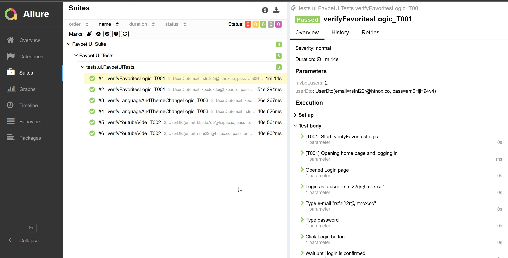
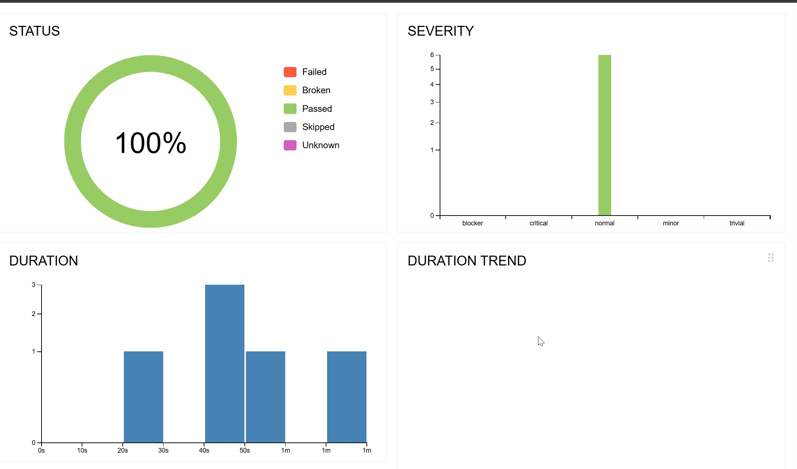
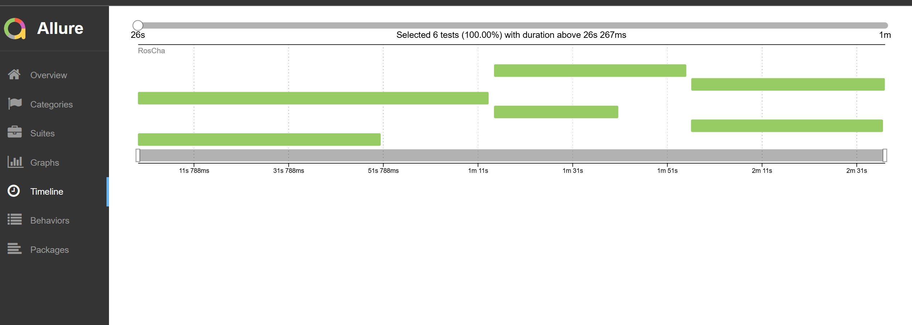
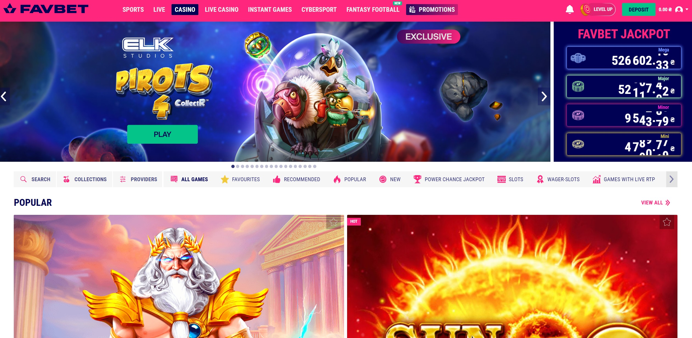

## Project Tech Stack
- Java 17 
- Gradle 
- Spring 
- TestNG 

## Project Key Features
- RTM 
Requirement Traceability Matrix, Automation is a tool, so all AUTOMATION TESTS should be linked to TEST CASES, and they should be linked to USER STORIES
- Parallelization 
It dramatically reduces Test Run time
- Data Provider 
Add the possibility to run the same code with different data sets (together with Parallelization IT IS A GAME CHANGER)
- Docker 
No more "it works locally" issue -> simplifies CI/CD and remote run
- Allure Report 
Just take a look at all statistics that it provides
- Page Object Structure 
It will make easier to develop UI tests

## Project Structure
automation-framework-example
├─ src
│  ├─ main/java
│  │   └─ automationframeworkexample
│  │       ├─ clients   ← API + UI page objects
│  │       └─ utils     ← custom loggers, retry, wrappers
│  └─ test/java
│      └─ tests
│          ├─ ui       ← TestNG UI suites
│          └─ api      ← (future) API suites
├─ Dockerfile
├─ README.md
└─ build.gradle.kts

## Project Report

-------------------------------------------------------------------------------------
- Local run (Chrome needed)
git clone 
cd automation-framework-example
./gradlew clean test                # head-less Chromium is auto-downloaded
./gradlew allureReport              # generates HTML report at build/allure-report
- Container Run
docker build -t favbet-tests .
docker run --rm favbet-tests               # default browser = chromium
docker run --rm -e browser=firefox favbet-tests   # if Firefox is enabled

